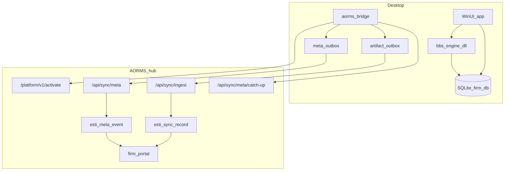

> **AQC copy** of the AORMS portal sync bridge. Canonical may also live in
> `esti/docs/esti/PORTAL-SYNC-BRIDGE.md`. Implement `aorms_bridge` + SQLite here
> first; AStudio / AConsulting consume the shared package.
>
> **Open source for now.** SaaS commercial licensing deferred.
# Portal Sync Bridge — desktop DB ↔ AORMS hub

**Status:** Canonical connector design · **Version:** `2026-08-bridge` · **Updated:** 2026-08-07  
**Wire base:** [HUB-API.md](HUB-API.md) (`2026-08`) · **Planes:** [LOCAL-FIRST.md](LOCAL-FIRST.md) ·  
**Contracts:** [`packages/contracts/src/sync.ts`](../../packages/contracts/src/sync.ts)

Desktop apps (AQC · AStudio · AConsulting) hold the **firm working database**.
The hub never recomputes BBS/estimate numbers. Portals read **published** meta +
artifacts only.

**Open source:** bridge and apps stay OSS for now; SaaS commercial licensing deferred.

---

## Problem

[AQC](https://github.com/HolagundiWorks/AQC) today persists projects as **`.bbsproj`
JSON** — no hub connector. Required: local DB + `aorms_bridge` that speaks the
existing activate / meta / ingest APIs.

## Architecture

## 1. Local persistence (SQLite)

| Concern | Rule |
| --- | --- |
| Path | `%LocalAppData%\{App}\firm.db` (per install) |
| Engine | C++ `bbs_engine` remains SoT for derived quantities/money |
| DB stores | Inputs, committed outputs, outbox rows, sync cursor, licence tokens |
| Migration | Import `.bbsproj` → SQLite once; keep export for backup |

**Suggested tables (minimum):**

- `org_settings` — `install_id`, `license_token`, `sync_token`, `hub_url`, `licence_status`
- `project` — local project rows (work + publishable flags)
- `meta_outbox` — `(id, entity, entity_id, op, payload_json, seq_local, state, error)`
- `artifact_outbox` — `(id, entity, entity_id, content_hash, storage_key, payload_json, state)`
- `meta_cursor` — last applied hub `seq` per stream
- domain work tables as needed (BOQ lines stay **localOnly** until finalize)

## 2. Module `aorms_bridge`

Shared library (C# preferred next to WinUI; or C++ with JSON C API) consumed by
AQC, then AStudio / AConsulting.

| API surface | Hub call | Notes |
| --- | --- | --- |
| `Activate(licenseKey)` | `POST /platform/v1/activate` | Persist `licenseToken` + **`syncToken`** |
| `Refresh()` | `POST /platform/v1/refresh` | Persist `syncToken` if minted |
| `EnqueueMeta(event)` | local outbox | No network |
| `EnqueueArtifact(entity, bytes, dto)` | local outbox | Content-hash skip |
| `Flush()` | `POST /api/sync/meta` + `POST /api/sync/ingest` | Bearer `syncToken` |
| `PullMeta()` | `GET /api/sync/meta/catch-up` | Multi-seat wave 2 |
| `HubConfigured` | local | `{ hubUrl, hasSyncToken, syncReady }` |

Env / settings (align HUB-API):

- `ESTI_LICENSE_API_URL` — e.g. `https://aorms.in/platform`
- `ESTI_PRODUCT_API_KEY`
- `ESTI_HUB_URL` — e.g. `https://aorms.in`
- `INSTALL_ID` — stable device id

## 3. Publish allow-list (portal-visible)

### Artifacts (`SyncEntity`)

`drawing` · `transmittal` · `invoice` · `approval` · `tender` · `runningBill` ·
`inspection` · `siteVisit` · `siteReference` · `progressReport`

### Metadata (`MetaEntity`)

`task` · `taskStatus` · `estimateTotals` · `phaseProgress` · `invoiceStatus` ·
`drawingRegister` · `approvalState` · `projectStatus` · `presence`

### Must not sync

- AI transcripts / model weights  
- Measurement scratch / nested estimate **lines** until finalize  
- Draft drawings / unissued PDFs  

Portal IA maps to: **Updates** (activity/meta) · **Progress** (`phaseProgress`) ·
**Drawings** (READY) · **Documents / numbers** (issued PDFs + `estimateTotals` /
invoice scalars).

## 4. Conflict policy

Unchanged from HUB-API / contracts:

- Task-like: **LWW per field**  
- Derived money / progress: **server seq wins**

## 5. Implementation order

| Step | Owner | Exit |
| --- | --- | --- |
| 1 | AQC | SQLite + migrate one `.bbsproj` |
| 2 | AQC | `aorms_bridge` activate + Flush meta smoke |
| 3 | AQC | Artifact ingest + portal read via hub |
| 4 | shared | Package bridge for AStudio / AConsulting forks |
| 5 | esti hub | Extend `hubPortal` coverage for all allow-list entities |

Spike tracker: [AQC-BRIDGE-SPIKE.md](AQC-BRIDGE-SPIKE.md).

## 6. Versioning

Breaking changes to paths, auth, or required fields bump:

1. This doc’s version tag  
2. [HUB-API.md](HUB-API.md) tag  
3. `@esti/contracts`  
4. Sibling `docs/SYNC-CONTRACT.md` pins  

Non-breaking allow-list additions are additive only.

## Related

- [HUB-API.md](HUB-API.md) · [LOCAL-FIRST.md](LOCAL-FIRST.md) · [DESKTOP-REPOS.md](DESKTOP-REPOS.md)  
- `backend/src/lib/sync/hubPortal.ts` · `backend/src/modules/sync/routes.ts`  

